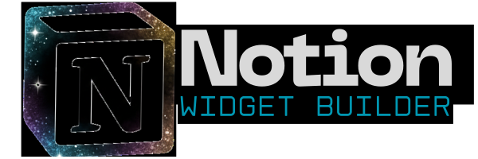

<div align="center">



# ⚡ JaZeR Notion Widget Builder

### *Cyberpunk-Powered Widget Creation for Notion*

[](https://jazer-444.github.io/notion-widget-builder/)
[](./LICENSE)

[](https://react.dev/)
[](https://vitejs.dev/)
[](https://tailwindcss.com/)
[](./BRAND_GUIDELINES.md)

**Create stunning, fully customizable widgets with official JaZeR branding.**  
Visual builder • Real-time preview • Standalone exports • Zero dependencies

[Features](#-features) • [Quick Start](#-quick-start) • [Widgets](#-widget-catalog) • [Documentation](#-documentation) • [Deploy](#-deployment)

</div>

---

## ✨ Features

<table>
<tr>
<td width="50%">

### 🎨 **Visual Builder**
- **Real-time Preview** - See changes instantly as you customize
- **Resizable Canvas** - Test widgets at any size
- **Interactive Config Panel** - Intuitive controls for all settings
- **Live Color Picker** - JaZeR brand colors + custom palette support

### 🚀 **Export & Deploy**
- **Standalone HTML** - Zero dependencies (except fonts)
- **Copy Code** - Instant clipboard copy for quick embedding
- **Download File** - Ready-to-host HTML files
- **Universal Compatibility** - Works in Notion, websites, anywhere

</td>
<td width="50%">

### 🌈 **Brand System**
- **JaZeR Neon Theme** - Official 10-color cyberpunk palette
- **Logo Upload** - Extract brand colors from any image (ColorThief)
- **8 Auto Presets** - Monochrome, Contrast, Vibrant, Professional, Dark, Light, Neon, Minimal
- **Light/Dark Modes** - System-aware theme switching

### 🎯 **Widget Features**
- **8 Widget Types** - From clocks to galleries to life trackers
- **Fully Customizable** - Colors, fonts, sizes, effects, animations
- **Responsive** - Mobile, tablet, desktop optimized
- **Accessible** - WCAG AA compliant with focus states

</td>
</tr>
</table>

---

## 🚀 Quick Start

### Prerequisites

- **Node.js** 18+ ([Download](https://nodejs.org/))
- **npm** 9+ (included with Node.js)
- **Git** ([Download](https://git-scm.com/))

### Installation

```bash
# Clone the repository
git clone https://github.com/yourusername/notion-widget-builder.git
cd notion-widget-builder

# Install dependencies
npm install

# Start development server (opens at http://localhost:3000)
npm run dev
```

### Build & Preview

```bash
# Create optimized production build
npm run build

# Preview production build locally
npm run preview

# Run ESLint
npm run lint
```

### Deploy to GitHub Pages

```bash
# Build and deploy in one command
npm run deploy
```

> **Note:** The app is configured for GitHub Pages deployment at `https://jazer-444.github.io/notion-widget-builder/`. Update `base` in `vite.config.js` for custom domains.

---

## 📦 Widget Catalog

<table>
<tr>
<td width="25%" align="center">

### ⏰ Clock
Multiple display styles  
Analog • Digital • Flip  
Timezone support  
Custom fonts & colors

</td>
<td width="25%" align="center">

### ⏳ Countdown
Event countdowns  
Custom date/time targets  
Label customization  
Days/Hours/Minutes/Seconds

</td>
<td width="25%" align="center">

### 🔢 Counter
Number tracking  
Increment/Decrement  
Min/Max values  
Goal progress display

</td>
<td width="25%" align="center">

### 🌤️ Weather
Current conditions  
Multi-day forecasts  
Location-based  
Custom units (°C/°F)

</td>
</tr>
<tr>
<td width="25%" align="center">

### 🖼️ Image Gallery
Multiple layouts  
Grid • Carousel • Masonry  
Lightbox support  
Caption overlay

</td>
<td width="25%" align="center">

### 💬 Quotes
Inspirational quotes  
Auto-rotation  
Custom quote sets  
Beautiful typography

</td>
<td width="25%" align="center">

### 📊 Life Progress
Time visualization  
Year/Month/Week/Day  
Progress bars  
Motivational display

</td>
<td width="25%" align="center">

### 🔘 Button Generator
Custom styled buttons  
Hover effects  
Action links  
Neon glow animations

</td>
</tr>
</table>

### Widget Capabilities

All widgets support:
- ✅ **Light/Dark Mode** - Automatic system detection or manual override
- ✅ **Brand Themes** - Apply JaZeR neon theme or custom logo colors
- ✅ **Responsive Sizing** - Container queries for adaptive layouts
- ✅ **Background Textures** - Stars, noise, dots, grid, waves (SVG/CSS)
- ✅ **Export Formats** - Standalone HTML with inline styles
- ✅ **Zero Dependencies** - Self-contained (except Google Fonts CDN)

---

## 🎯 How to Use in Notion

### Step 1: Build Your Widget

1. **Select Widget Type** - Choose from 8 available widget types on the landing page
2. **Customize Settings** - Use the configuration panel to adjust:
   - Colors (brand presets or custom picker)
   - Typography (fonts, sizes, weights)
   - Layout (sizes, spacing, alignment)
   - Effects (glow, gradients, shadows)
   - Widget-specific features
3. **Live Preview** - See real-time changes in the preview panel
4. **Upload Brand Logo** (Optional) - Auto-extract 8 colors and apply themed presets

### Step 2: Export Widget

Choose your export method:

| Method | Description | Use Case |
|--------|-------------|----------|
| **📥 Download HTML** | Get standalone `.html` file | Self-hosting, full control |
| **📋 Copy Code** | Copy HTML to clipboard | Quick embed, paste anywhere |

### Step 3: Host Your Widget

#### Option A: GitHub Pages (Free, Recommended)
```bash
# Create a new repository on GitHub
git init
git add widget.html
git commit -m "Add widget"
git branch -M main
git remote add origin https://github.com/yourusername/your-repo.git
git push -u origin main

# Enable GitHub Pages in repository settings
# Your widget will be live at: https://yourusername.github.io/your-repo/widget.html
```

#### Option B: Vercel (Fastest)
```bash
npm i -g vercel
vercel --prod
# Paste the deployment URL in Notion
```

#### Option C: Netlify Drop
1. Go to [app.netlify.com/drop](https://app.netlify.com/drop)
2. Drag & drop your HTML file
3. Get instant public URL

#### Option D: Direct HTML (Simple Pages)
Host on any static server: Firebase, Surge, Cloudflare Pages, etc.

### Step 4: Embed in Notion

1. **Open your Notion page**
2. **Type `/embed`** and press Enter
3. **Paste your widget URL** (e.g., `https://yourusername.github.io/repo/widget.html`)
4. **Resize the embed block** to fit your design
5. **Done!** Your widget is now live in Notion 🎉

### 💡 Pro Tips

- **Resize Widget Canvas**: Test different sizes in the builder before exporting
- **Use Brand Presets**: Upload your logo once, get 8 themed variations instantly
- **Dark Mode**: Enable appearance mode for automatic light/dark switching
- **Responsive Sizing**: Enable container queries for adaptive scaling in Notion
- **Multiple Widgets**: Create a single HTML file with multiple widgets for organization

---

## 🎨 JaZeR Brand System

The application fully implements the official JaZeR cyberpunk brand identity with neon aesthetics, futuristic typography, and a vibrant 10-color palette.

### Color Palette

<table>
<tr>
<th>Category</th>
<th>Color</th>
<th>Hex</th>
<th>Usage</th>
</tr>
<tr>
<td rowspan="2"><b>Primary</b></td>
<td>🟣 <b>Electric Purple</b></td>
<td><code>#8B5CF6</code></td>
<td>Headings, primary CTAs, brand anchor</td>
</tr>
<tr>
<td>🔵 <b>Cosmic Blue</b></td>
<td><code>#3B82F6</code></td>
<td>Links, interactive elements, secondary brand</td>
</tr>
<tr>
<td rowspan="2"><b>Accent</b></td>
<td>🩷 <b>Neon Pink</b></td>
<td><code>#EC4899</code></td>
<td>Highlights, attention elements, hover states</td>
</tr>
<tr>
<td>🟡 <b>Sunburst Gold</b></td>
<td><code>#F59E0B</code></td>
<td>Warnings, alerts, call-to-action emphasis</td>
</tr>
<tr>
<td rowspan="2"><b>Support</b></td>
<td>🩵 <b>Aether Teal</b></td>
<td><code>#06B6D4</code></td>
<td>Accents on dark backgrounds, info states</td>
</tr>
<tr>
<td>🟣 <b>Ultraviolet</b></td>
<td><code>#A78BFA</code></td>
<td>Secondary buttons, subtle highlights</td>
</tr>
<tr>
<td rowspan="4"><b>Neutrals</b></td>
<td>⚫ <b>Night Black</b></td>
<td><code>#0B0E12</code></td>
<td>Default background, dark surfaces</td>
</tr>
<tr>
<td>⚪ <b>Stardust White</b></td>
<td><code>#F8F9FF</code></td>
<td>Default text, light mode backgrounds</td>
</tr>
<tr>
<td>⬛ <b>Graphite</b></td>
<td><code>#1F2937</code></td>
<td>Cards, panels, UI elements</td>
</tr>
<tr>
<td>🔘 <b>Soft Slate</b></td>
<td><code>#94A3B8</code></td>
<td>Captions, disabled states, borders</td>
</tr>
</table>

### Typography

| Font | Usage | Weights | Features |
|------|-------|---------|----------|
| **Orbitron** | Headings, Titles, Widget Labels | 400, 700 | +3% letter-spacing, Futuristic |
| **Montserrat** | Body, UI Text, Descriptions | 400, 500, 700 | Readable, Clean |

### Visual Effects

```css
/* Neon Glow */
text-shadow: 0 0 4px rgba(139, 92, 246, 0.6);

/* Full Spectrum Gradient */
background: linear-gradient(135deg, 
  #8B5CF6 0%,    /* Electric Purple */
  #3B82F6 25%,   /* Cosmic Blue */
  #06B6D4 50%,   /* Aether Teal */
  #EC4899 75%,   /* Neon Pink */
  #F59E0B 100%   /* Sunburst Gold */
);

/* Purple-Blue Gradient */
background: linear-gradient(135deg, #8B5CF6 0%, #3B82F6 100%);
```

### Usage in Code

```jsx
// Tailwind CSS Classes
<h1 className="font-heading text-6xl bg-jazer-gradient-purple-blue bg-clip-text text-transparent">
<button className="bg-jazer-electric-purple shadow-neon-purple hover:shadow-neon-pink">
<div className="bg-jazer-night-black text-jazer-stardust-white">

// CSS Variables
<div style={{ 
  color: 'var(--jazer-cosmic-blue)',
  textShadow: 'var(--jazer-neon-glow-purple)'
}}>

// JavaScript Constants
import { jazerNeonTheme } from './theme/jazerNeonTheme';
const color = jazerNeonTheme.colors.electricPurple;
const gradient = jazerNeonTheme.gradients.purpleBlue;
```

### Brand Theme Generator

Upload any logo and automatically extract **8 brand-consistent color presets**:

| Preset | Description | Best For |
|--------|-------------|----------|
| **Monochrome** | Single dominant hue | Minimalist designs |
| **Contrast** | High contrast pairs | Readability focus |
| **Vibrant** | Bright, energetic colors | Eye-catching widgets |
| **Professional** | Muted, balanced tones | Corporate/business |
| **Dark** | Deep background tones | Dark mode interfaces |
| **Light** | Bright, airy palette | Light mode interfaces |
| **Neon** | High saturation glows | Cyberpunk aesthetic |
| **Minimal** | Subtle, understated | Clean, modern look |

**Powered by ColorThief** - Extracts dominant colors using k-means clustering for intelligent palette generation.

### Documentation

📚 **Full Brand Guidelines**: [`BRAND_GUIDELINES.md`](./BRAND_GUIDELINES.md)  
📊 **Implementation Summary**: [`BRAND_IMPLEMENTATION_SUMMARY.md`](./BRAND_IMPLEMENTATION_SUMMARY.md)  
🎨 **Theme Generator Guide**: [`BRAND_THEME_GENERATOR_GUIDE.md`](./BRAND_THEME_GENERATOR_GUIDE.md)  
⚡ **Quick Reference**: [`BRAND_QUICK_REFERENCE.md`](./BRAND_QUICK_REFERENCE.md)

---

## 🛠️ Tech Stack

### Core Technologies

| Technology | Version | Purpose |
|------------|---------|---------|
| **React** | 19.2.0 | UI framework with latest features |
| **Vite** | 7.2.5 (Rolldown) | Lightning-fast build tool with Rolldown bundler |
| **TailwindCSS** | 3.4.18 | Utility-first styling framework |
| **Lucide React** | 0.554.0 | Beautiful icon library (1000+ icons) |
| **ColorThief** | 2.6.0 | AI-powered color extraction from images |
| **ESLint** | 9.x | Code quality with flat config format |

### Build Configuration

**Vite** (`vite.config.js`):
- Base path: `/` (custom domain: jazer-444.github.io/notion-widget-builder)
- Code splitting: React vendor chunk + icon chunk optimization
- Dev server: Port 3000 with auto-open browser
- Output: `dist/` with optimized assets

**Tailwind** (`tailwind.config.js`):
- Scans: `index.html` + `src/**/*.{js,ts,jsx,tsx}`
- Custom utilities: JaZeR brand colors, neon glow shadows, gradients
- Responsive breakpoints: Mobile-first approach

**ESLint** (`eslint.config.js`):
- Flat config format (ESLint 9+)
- React Hooks plugin + React Refresh
- Ignore unused vars starting with uppercase/underscore

### Development Scripts

```bash
npm run dev        # Start dev server (http://localhost:3000)
npm run build      # Production build → dist/
npm run preview    # Preview production build locally
npm run lint       # Run ESLint checks
npm run deploy     # Build + deploy to GitHub Pages
```

### Project Structure

```
notion-widget-builder/
├── src/
│   ├── widgets/                  # Widget modules (8 types)
│   │   ├── clock-widget/
│   │   │   ├── config.js         # Widget configuration schema
│   │   │   ├── ClockWidget.jsx   # React component for preview
│   │   │   └── export.js         # HTML/JS generator
│   │   ├── countdown-widget/
│   │   ├── counter-widget/
│   │   ├── weather-widget/
│   │   ├── image-gallery-widget/
│   │   ├── quotes-widget/
│   │   ├── life-progress-bar-widget/
│   │   └── new-button-generator-widget/
│   ├── theme/
│   │   └── jazerNeonTheme.js     # Brand theme constants
│   ├── contexts/
│   │   └── ThemeContext.jsx      # React Context for theming
│   ├── utils/
│   │   └── brandThemeGenerator.js # Logo color extraction
│   ├── components/
│   │   └── BrandLogoUploader.jsx # Logo upload UI
│   ├── App.jsx                   # Main application (~25,000+ tokens)
│   ├── main.jsx                  # React entry point
│   └── index.css                 # Global styles + Tailwind
├── public/                       # Static assets
├── dist/                         # Production build output
├── index.html                    # HTML entry point
├── vite.config.js                # Vite configuration
├── tailwind.config.js            # Tailwind configuration
├── eslint.config.js              # ESLint configuration
└── package.json                  # Dependencies + scripts
```

### Widget Architecture

All widgets follow a **modular three-file pattern**:

1. **`config.js`** - Configuration schema
   - `id`, `label`, `description`
   - `defaultConfig` with all settings
   - `fields` array defining UI controls
   - Must import `jazerNeonTheme` for brand consistency

2. **`<WidgetName>Widget.jsx`** - React preview component
   - Receives `config` prop
   - Renders live preview in builder
   - Supports light/dark/system appearance modes

3. **`export.js`** - Standalone generator
   - `generateWidgetHTML(config)` - Complete HTML document
   - `generateWidgetScript(config)` - Vanilla JavaScript
   - Zero dependencies (except Google Fonts CDN)
   - Embeds `jazerNeonTheme` fonts, variables, and animations

### Key Features

- **Glassmorphic UI** - Backdrop blur, transparency, neon borders
- **Container Queries** - Responsive widgets adapt to embed size
- **SVG Textures** - Stars, noise, dots, grid, waves (inline data URIs)
- **Dark Mode First** - System preference detection + manual toggle
- **Accessibility** - WCAG AA contrast, focus states, keyboard navigation
- **Zero Config** - Works out of the box, optional customization

---

## 🛠️ Tech Stack

### Core Technologies

| Technology | Version | Purpose |
|------------|---------|---------|
| **React** | 19.2.0 | UI framework with latest features |
| **Vite** | 7.2.5 (Rolldown) | Lightning-fast build tool with Rolldown bundler |
| **TailwindCSS** | 3.4.18 | Utility-first styling framework |
| **Lucide React** | 0.554.0 | Beautiful icon library (1000+ icons) |
| **ColorThief** | 2.6.0 | AI-powered color extraction from images |
| **ESLint** | 9.x | Code quality with flat config format |

### Build Configuration

**Vite** (`vite.config.js`):
- Base path: `/` (custom domain: jazer-444.github.io/notion-widget-builder)
- Code splitting: React vendor chunk + icon chunk optimization
- Dev server: Port 3000 with auto-open browser
- Output: `dist/` with optimized assets

**Tailwind** (`tailwind.config.js`):
- Scans: `index.html` + `src/**/*.{js,ts,jsx,tsx}`
- Custom utilities: JaZeR brand colors, neon glow shadows, gradients
- Responsive breakpoints: Mobile-first approach

**ESLint** (`eslint.config.js`):
- Flat config format (ESLint 9+)
- React Hooks plugin + React Refresh
- Ignore unused vars starting with uppercase/underscore

### Development Scripts

```bash
npm run dev        # Start dev server (http://localhost:3000)
npm run build      # Production build → dist/
npm run preview    # Preview production build locally
npm run lint       # Run ESLint checks
npm run deploy     # Build + deploy to GitHub Pages
```

### Project Structure

```
notion-widget-builder/
├── src/
│   ├── widgets/                  # Widget modules (8 types)
│   │   ├── clock-widget/
│   │   │   ├── config.js         # Widget configuration schema
│   │   │   ├── ClockWidget.jsx   # React component for preview
│   │   │   └── export.js         # HTML/JS generator
│   │   ├── countdown-widget/
│   │   ├── counter-widget/
│   │   ├── weather-widget/
│   │   ├── image-gallery-widget/
│   │   ├── quotes-widget/
│   │   ├── life-progress-bar-widget/
│   │   └── new-button-generator-widget/
│   ├── theme/
│   │   └── jazerNeonTheme.js     # Brand theme constants
│   ├── contexts/
│   │   └── ThemeContext.jsx      # React Context for theming
│   ├── utils/
│   │   └── brandThemeGenerator.js # Logo color extraction
│   ├── components/
│   │   └── BrandLogoUploader.jsx # Logo upload UI
│   ├── App.jsx                   # Main application (~25,000+ tokens)
│   ├── main.jsx                  # React entry point
│   └── index.css                 # Global styles + Tailwind
├── public/                       # Static assets
├── dist/                         # Production build output
├── index.html                    # HTML entry point
├── vite.config.js                # Vite configuration
├── tailwind.config.js            # Tailwind configuration
├── eslint.config.js              # ESLint configuration
└── package.json                  # Dependencies + scripts
```

### Widget Architecture

All widgets follow a **modular three-file pattern**:

1. **`config.js`** - Configuration schema
   - `id`, `label`, `description`
   - `defaultConfig` with all settings
   - `fields` array defining UI controls
   - Must import `jazerNeonTheme` for brand consistency

2. **`<WidgetName>Widget.jsx`** - React preview component
   - Receives `config` prop
   - Renders live preview in builder
   - Supports light/dark/system appearance modes

3. **`export.js`** - Standalone generator
   - `generateWidgetHTML(config)` - Complete HTML document
   - `generateWidgetScript(config)` - Vanilla JavaScript
   - Zero dependencies (except Google Fonts CDN)
   - Embeds `jazerNeonTheme` fonts, variables, and animations

### Key Features

- **Glassmorphic UI** - Backdrop blur, transparency, neon borders
- **Container Queries** - Responsive widgets adapt to embed size
- **SVG Textures** - Stars, noise, dots, grid, waves (inline data URIs)
- **Dark Mode First** - System preference detection + manual toggle
- **Accessibility** - WCAG AA contrast, focus states, keyboard navigation
- **Zero Config** - Works out of the box, optional customization

---

## 🚢 Deployment

### Automated Deployment (GitHub Actions)

The repository includes automated CI/CD via GitHub Actions:

```yaml
Trigger: Push to 'master' branch (or manual dispatch)
Build: Node 20 → npm ci → npm run build
Deploy: dist/ → GitHub Pages (gh-pages branch)
Custom Domain: https://jazer-444.github.io/notion-widget-builder/
```

**Location**: `.github/workflows/deploy.yml`

### Manual Deployment Options

#### 1️⃣ GitHub Pages (Free, Unlimited)

```bash
# Option A: Using gh-pages package (recommended)
npm run deploy  # Builds and deploys automatically

# Option B: Manual deployment
npm run build
git add dist -f
git commit -m "Deploy to GitHub Pages"
git subtree push --prefix dist origin gh-pages
```

**Setup**:
1. Go to repository **Settings** → **Pages**
2. Source: Deploy from branch `gh-pages`
3. Custom domain (optional): Add CNAME record pointing to `<username>.github.io`

#### 2️⃣ Vercel (Fastest, Auto SSL)

```bash
# Install Vercel CLI
npm i -g vercel

# Deploy
vercel --prod
```

**Features**: Instant previews, automatic HTTPS, global CDN, zero config

#### 3️⃣ Netlify (Drag & Drop)

**Option A: Netlify Drop**
1. Visit [app.netlify.com/drop](https://app.netlify.com/drop)
2. Run `npm run build`
3. Drag `dist/` folder
4. Get instant URL

**Option B: Git Integration**
1. Connect repository to Netlify
2. Build command: `npm run build`
3. Publish directory: `dist`
4. Auto-deploy on push

#### 4️⃣ Cloudflare Pages

```bash
npm run build
npx wrangler pages deploy dist
```

#### 5️⃣ Other Static Hosts

- **Firebase Hosting**: `firebase deploy`
- **Surge**: `surge dist/`
- **Render**: Connect repo, build & deploy
- **AWS S3 + CloudFront**: Upload `dist/` to S3 bucket

### Environment Configuration

Update `vite.config.js` for custom domains:

```js
export default defineConfig({
  base: '/notion-widget-builder/',  // For GitHub Pages
  // OR
  base: '/',  // For custom domain
});
```

---

## 📚 Documentation

### Core Documentation

| Document | Description |
|----------|-------------|
| **[BRAND_GUIDELINES.md](./BRAND_GUIDELINES.md)** | Complete brand specifications (colors, typography, effects) |
| **[BRAND_IMPLEMENTATION_SUMMARY.md](./BRAND_IMPLEMENTATION_SUMMARY.md)** | Implementation details and code examples |
| **[BRAND_QUICK_REFERENCE.md](./BRAND_QUICK_REFERENCE.md)** | Quick lookup for developers |
| **[FEATURE_VALIDATION_REPORT.md](./FEATURE_VALIDATION_REPORT.md)** | Feature audit and widget coverage analysis |
| **[IMPROVEMENTS_APPLIED.md](./IMPROVEMENTS_APPLIED.md)** | Change log and applied improvements |
| **[WIDGET_FEATURE_AUDIT.md](./WIDGET_FEATURE_AUDIT.md)** | Widget-by-widget feature documentation |

### Brand Theme System

| Document | Description |
|----------|-------------|
| **[BRAND_THEME_GENERATOR_GUIDE.md](./BRAND_THEME_GENERATOR_GUIDE.md)** | Comprehensive theme generator documentation |
| **[BRAND_THEME_GENERATOR_QUICKSTART.md](./BRAND_THEME_GENERATOR_QUICKSTART.md)** | Quick start guide for logo uploads |
| **[BRAND_THEME_GENERATOR_SUMMARY.md](./BRAND_THEME_GENERATOR_SUMMARY.md)** | Technical summary of color extraction |

### Developer Guides

| Document | Description |
|----------|-------------|
| **[CLAUDE.md](./CLAUDE.md)** | AI assistant guidance for code development |
| **[GEMINI.md](./GEMINI.md)** | Additional development context |
| **[ADDITIONAL_IMPROVEMENTS_ANALYSIS.md](./ADDITIONAL_IMPROVEMENTS_ANALYSIS.md)** | Future enhancement analysis |

---

## 🤝 Contributing

Contributions are welcome! Please follow these guidelines:

### Development Workflow

1. **Fork** the repository
2. **Create** a feature branch (`git checkout -b feature/amazing-widget`)
3. **Follow** JaZeR brand guidelines (see `BRAND_GUIDELINES.md`)
4. **Test** your changes (`npm run dev`)
5. **Lint** your code (`npm run lint`)
6. **Commit** with clear messages (`git commit -m "Add: New cosmic widget"`)
7. **Push** to your fork (`git push origin feature/amazing-widget`)
8. **Open** a Pull Request

### Adding a New Widget

See `CLAUDE.md` for detailed instructions. Quick summary:

1. Create `src/widgets/<widget-name>-widget/` directory (hyphenated lowercase)
2. Add `config.js` (import `jazerNeonTheme`, define schema)
3. Add `<WidgetName>Widget.jsx` (React component with `config` prop)
4. Add `export.js` (standalone HTML/JS generators)
5. Register in `src/App.jsx` (import, routing, config, export)

### Code Standards

- **Naming**: Hyphenated lowercase for directories (`clock-widget/`)
- **Colors**: Always use `jazerNeonTheme.colors.*` constants
- **Modes**: Support `lightMode` and `darkMode` configurations
- **Exports**: Zero dependencies (except Google Fonts CDN)
- **Accessibility**: WCAG AA contrast ratios, focus states
- **Comments**: Only comment complex logic, not obvious code

### Brand Compliance

All contributions must:
- ✅ Use official JaZeR color palette
- ✅ Implement Orbitron (headings) + Montserrat (body) fonts
- ✅ Support light/dark/system appearance modes
- ✅ Include neon glow effects on interactive elements
- ✅ Follow glassmorphic UI patterns

---

## 📄 License

**MIT License**

Copyright (c) 2026 JaZeR

Permission is hereby granted, free of charge, to any person obtaining a copy of this software and associated documentation files (the "Software"), to deal in the Software without restriction, including without limitation the rights to use, copy, modify, merge, publish, distribute, sublicense, and/or sell copies of the Software, and to permit persons to whom the Software is furnished to do so, subject to the following conditions:

The above copyright notice and this permission notice shall be included in all copies or substantial portions of the Software.

THE SOFTWARE IS PROVIDED "AS IS", WITHOUT WARRANTY OF ANY KIND, EXPRESS OR IMPLIED, INCLUDING BUT NOT LIMITED TO THE WARRANTIES OF MERCHANTABILITY, FITNESS FOR A PARTICULAR PURPOSE AND NONINFRINGEMENT. IN NO EVENT SHALL THE AUTHORS OR COPYRIGHT HOLDERS BE LIABLE FOR ANY CLAIM, DAMAGES OR OTHER LIABILITY, WHETHER IN AN ACTION OF CONTRACT, TORT OR OTHERWISE, ARISING FROM, OUT OF OR IN CONNECTION WITH THE SOFTWARE OR THE USE OR OTHER DEALINGS IN THE SOFTWARE.

---

## 👤 Author

<div align="center">


**JaZeR**  
*Cyberpunk Aesthetics & Innovation*

[](https://jazer-music.com)
[](https://jazer-444.github.io/notion-widget-builder/)

</div>

---

## 🙏 Acknowledgments

- **React Team** - For the amazing React 19 framework
- **Vite Team** - For the lightning-fast Rolldown bundler
- **TailwindCSS** - For utility-first styling excellence
- **Lucide Icons** - For beautiful, customizable icons
- **ColorThief** - For intelligent color extraction
- **Notion Team** - For the embeddable widget platform

---

## 💡 FAQ

<details>
<summary><b>Can I use these widgets outside of Notion?</b></summary>

Yes! The exported HTML files are standalone and work anywhere (websites, blogs, apps, etc.). Just embed the hosted URL using an `<iframe>`.
</details>

<details>
<summary><b>Do widgets work offline?</b></summary>

Mostly yes. Widgets are self-contained except for Google Fonts (Orbitron, Montserrat) loaded from CDN. For full offline support, download fonts locally.
</details>

<details>
<summary><b>Can I customize beyond the UI options?</b></summary>

Absolutely! Download the HTML, edit the inline styles/scripts, and re-host. Advanced users can modify widget source files directly.
</details>

<details>
<summary><b>How do I update a widget after deploying?</b></summary>

Re-export from the builder and replace the hosted HTML file. The Notion embed will automatically reflect changes (may need refresh).
</details>

<details>
<summary><b>Are there size limits for Notion embeds?</b></summary>

Notion embeds can be resized freely. Use the builder's resizable canvas to test different dimensions before exporting.
</details>

<details>
<summary><b>Can I use my own brand colors?</b></summary>

Yes! Upload your logo to auto-extract 8 colors, or manually customize all colors using the color picker. The builder saves your preferences.
</details>

<details>
<summary><b>How do I report bugs or request features?</b></summary>

Open an issue on GitHub with detailed description, steps to reproduce, and screenshots if applicable. Feature requests are always welcome!
</details>

---

<div align="center">

### 🚀 Ready to Build?

**[Launch Builder](https://jazer-444.github.io/notion-widget-builder/)** • **[View Docs](./BRAND_GUIDELINES.md)** • **[Report Issue](https://github.com/JaZeR-444/notion-widget-builder/issues)**

---

**Built with 💜 by JaZeR** | **Powered by Vite ⚡ + React ⚛️**

*Cyberpunk aesthetics meet functional design*

---

</div>

**Note**: This is a fully client-side application. Generated widgets are standalone HTML files that can be hosted anywhere and embedded into Notion pages using the `/embed` block. No backend required.
